# Collaborative Gherkin

A real-time collaborative editor for writing Gherkin acceptance criteria. 
Multiple people share a URL and edit the same document simultaneously. 
Sessions are ephemeral workspaces — the end product is exported Gherkin text or Markdown for tools like Jira, not a permanent record.
An AI Coach performs the hard work of checking things, and improving the quality of the Acceptance Criteria.

Acceptance Criteria are a critical mechanism to transfer the context of a business domain to the minds of the builders.
Acceptance Criteria allow the system users to deepen their own understanding of the information system they are building.
The collaborative wrestling with the acceptance criteria by the users, the builders and the testers helps ensure the system is built correctly.

---
# What problem does this solve?
Creating Acceptance Criteria in tools like jira, or confluence is difficult, because they offer only text editors, not anything specialised for this Domain Specific Language.
Adding remote working to this equation, creates friction, as those not typing, are watching someone else type slowly, make typos, and not capture the true intent of the statement.

Quality of Acceptance Criteria tends to be mediocre, as coaching/skill-improvement of writers is marginalised, and skills in this arena are unequally distributed.
Remote meeting fatigue also impacts the quality of outcome, as these sessions can become long and tedious, and reviewing the outcome becomes too hard.

What follows is a screenshot overview of a tool that tries to fix these problems.

---
# Screenshot Overview
## Home page

The home page lists recent sessions and provides a form to create a new one.

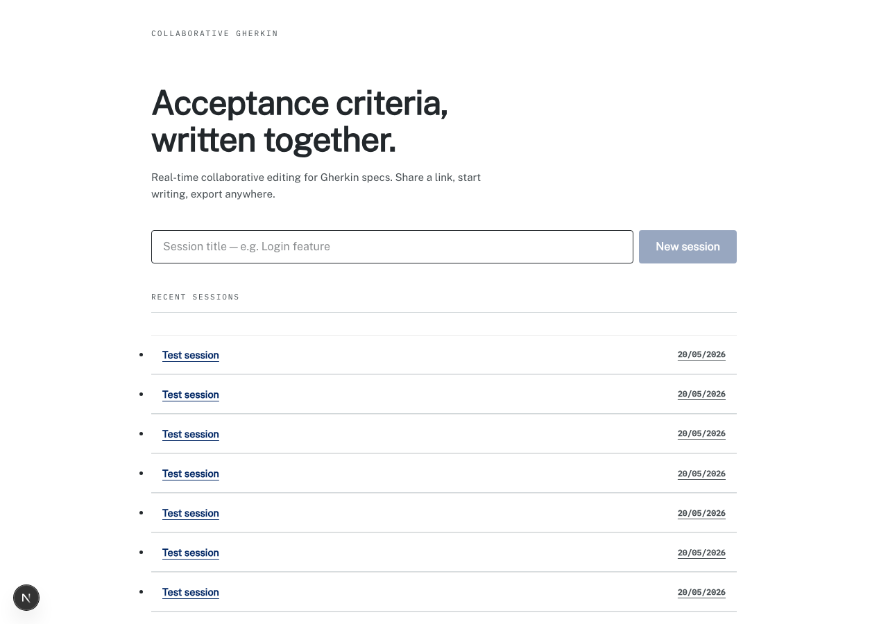

Enter a session title and click **New session** to create a workspace. Each session gets its own URL that can be shared immediately.

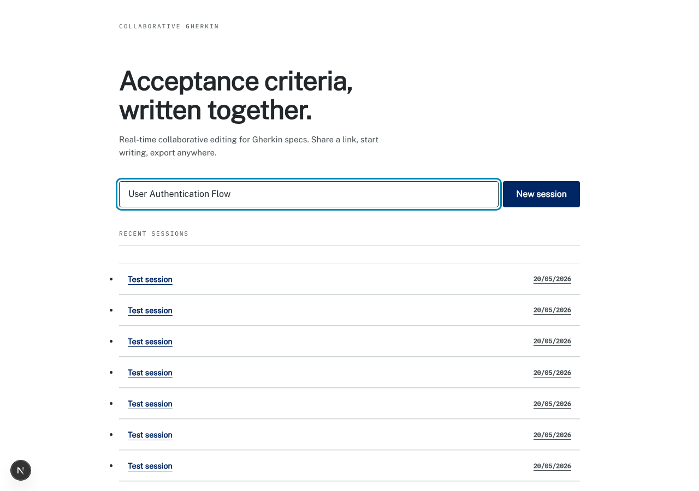

---

## The session editor

Opening a session lands you in the Gherkin editor. The toolbar across the top surfaces the block types that are valid to insert at the current cursor position. Export and Import buttons sit on the right side of the toolbar.

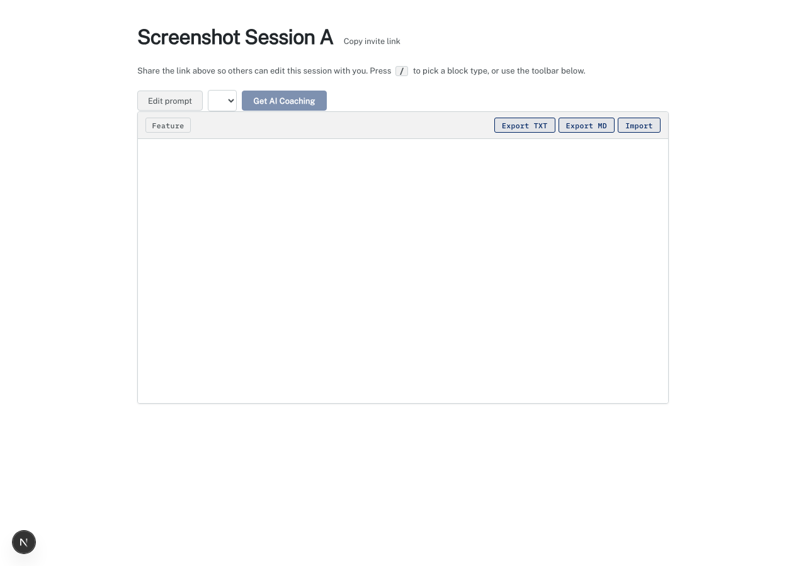

The toolbar always constrains choices to what is structurally valid. In an empty document the only option is **Feature** — inserting anything else would produce invalid Gherkin.

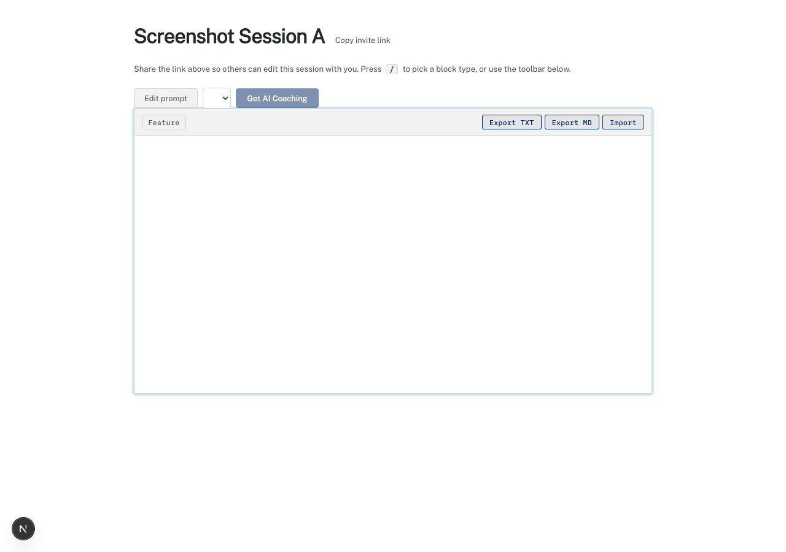

---

## Writing Gherkin blocks

### Toolbar insertion

Click any toolbar button to insert a block at the cursor. The toolbar re-evaluates after each insertion and shows only the blocks that can legally follow the current one. After inserting a **Then** step, the toolbar offers Rule, Scenario, Given, When, Then, And, But, Table, and Image — every block type that can follow a Then.


### Smart Enter progression

Pressing **Enter** at the end of a block auto-inserts the most natural next block type without touching the keyboard shortcut or toolbar:

| Current block | Enter produces |
|---|---|
| Feature | Scenario |
| Scenario | Given |
| Given | When |
| When | Then |
| Then | And |
| And | And |
| But | And |
| Background | Given |
| Rule | Scenario |

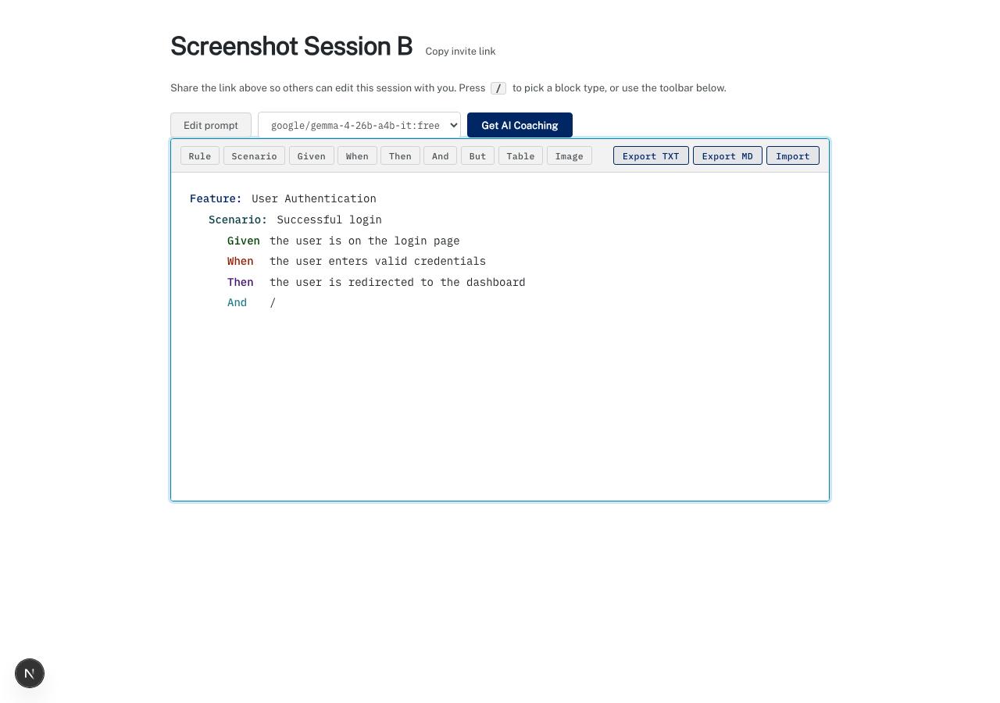

### Block picker (`/` key)

Typing `/` on any line opens a keyboard-navigable picker showing every block type valid at that position. Arrow keys move the selection; Enter or a click confirms; Escape dismisses without inserting. Typing `/` on an already-typed block switches to replace mode — the picker shows valid alternatives and selecting one swaps the block type in place without adding a new line.

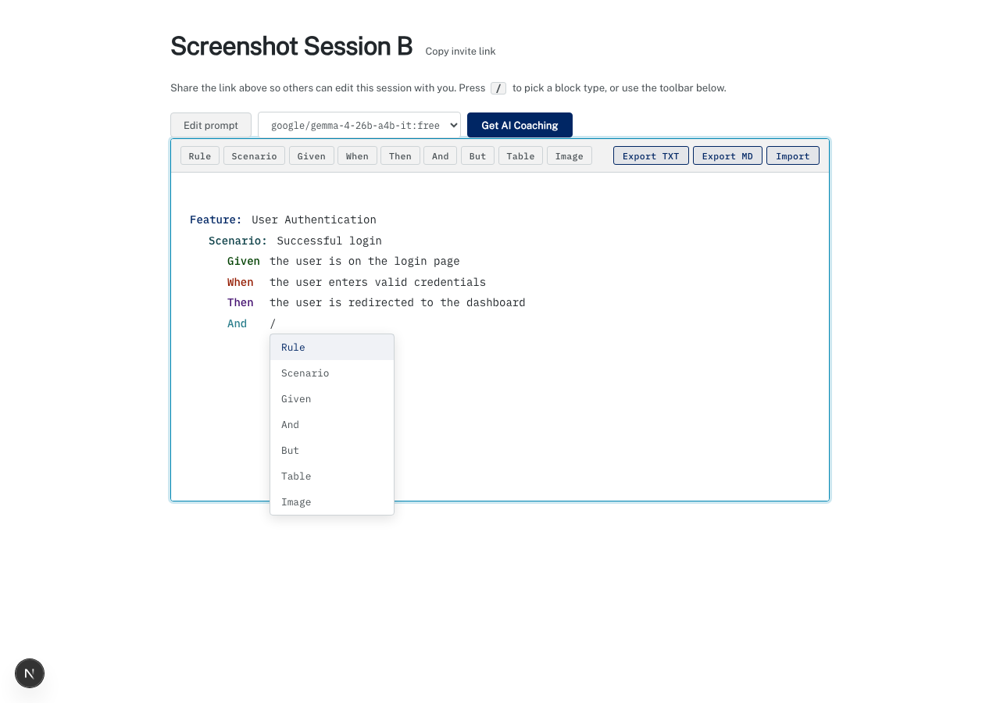

---

## Visual separation between scenarios

Scenario boundaries are rendered with a top border so the eye can scan a multi-scenario feature quickly. The separator is purely visual — it does not appear in exported output.

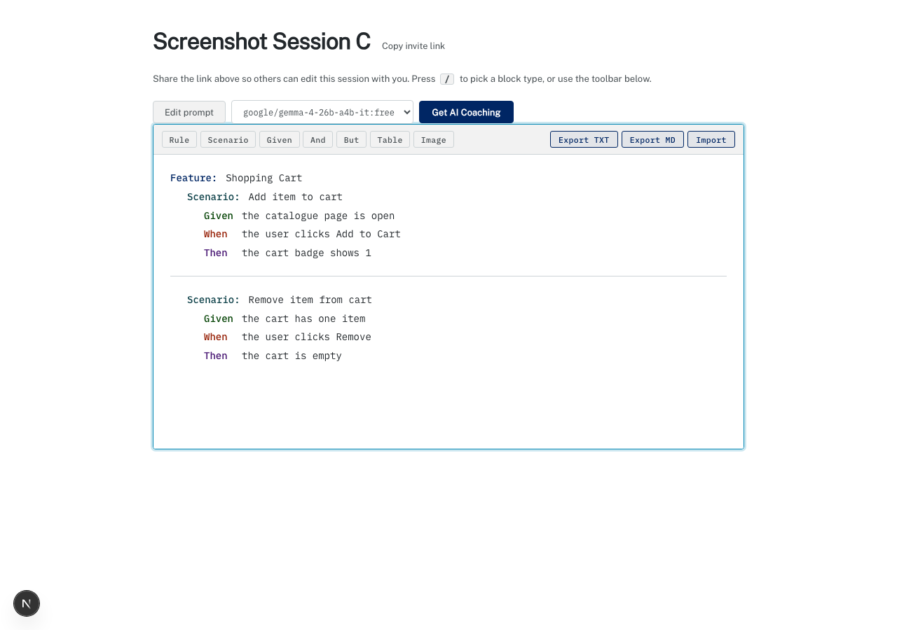

---

## Data tables

A **Table** button appears in the toolbar whenever the cursor is on a step block (Given, When, Then, And, But). Clicking it inserts an editable inline table beneath the step. Clicking into a cell reveals a floating table management toolbar with buttons to add/delete rows and columns.

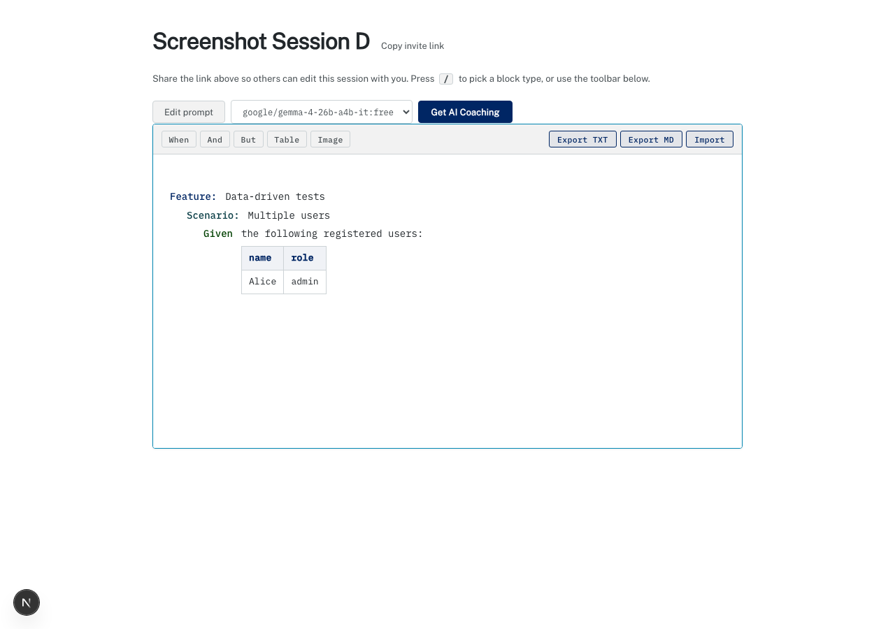

---

## Import

The **Import** button opens a modal with a textarea. Paste raw Gherkin text or Markdown-prefixed Gherkin (headings for Feature/Scenario, list items for steps). Clicking **Insert** parses the text and populates the editor; **Cancel** closes the modal without changing anything. Pipe-delimited rows in the pasted text are recognised and inserted as data table blocks.

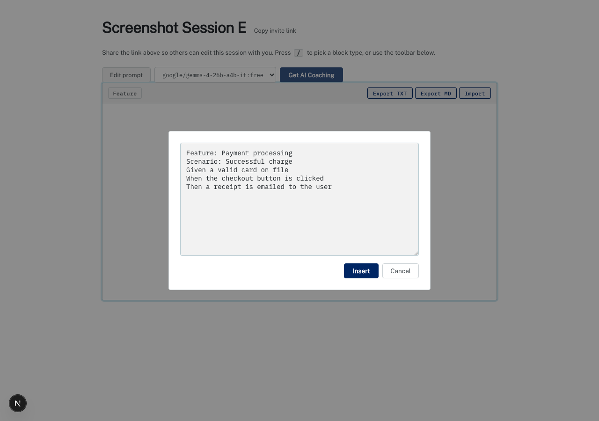

---

## Export

Two export buttons are always visible in the toolbar:

- **Export TXT** — downloads `gherkin.txt` in plain `Keyword: text` format, one block per line, with pipe-delimited rows for any data tables.
- **Export MD** — downloads `gherkin.md` using Markdown conventions: `#` headings for Feature, `##` for Scenario, `- list items` for steps, and a GFM pipe table with separator row for data tables.

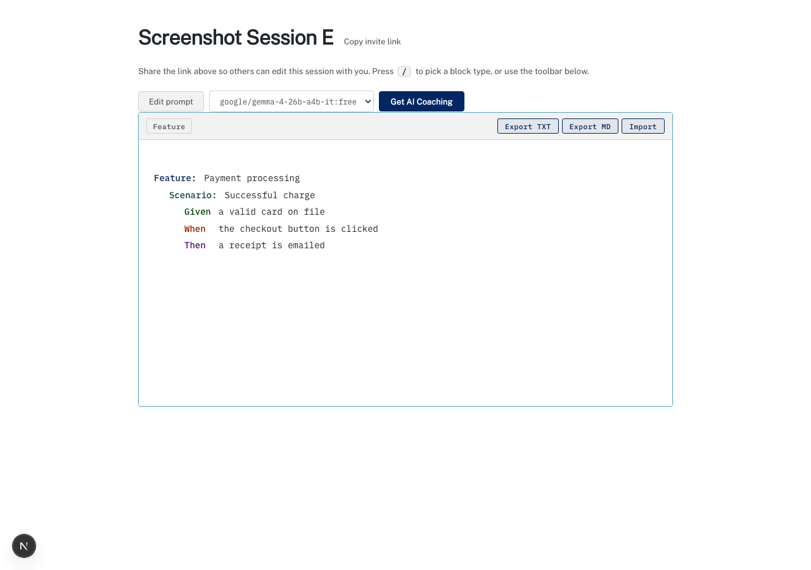

---

## Real-time collaboration

Share the session URL with teammates. Every editor connected to the same session sees changes live. Y.js CRDTs handle concurrent edits without conflicts. 
Collaborators' cursors appear with coloured labels so you can see where everyone is working.

Just like Google Docs, edits are real-time replicated between users.

To invite someone, click **Copy invite link** next to the session title — it copies the session URL to the clipboard.

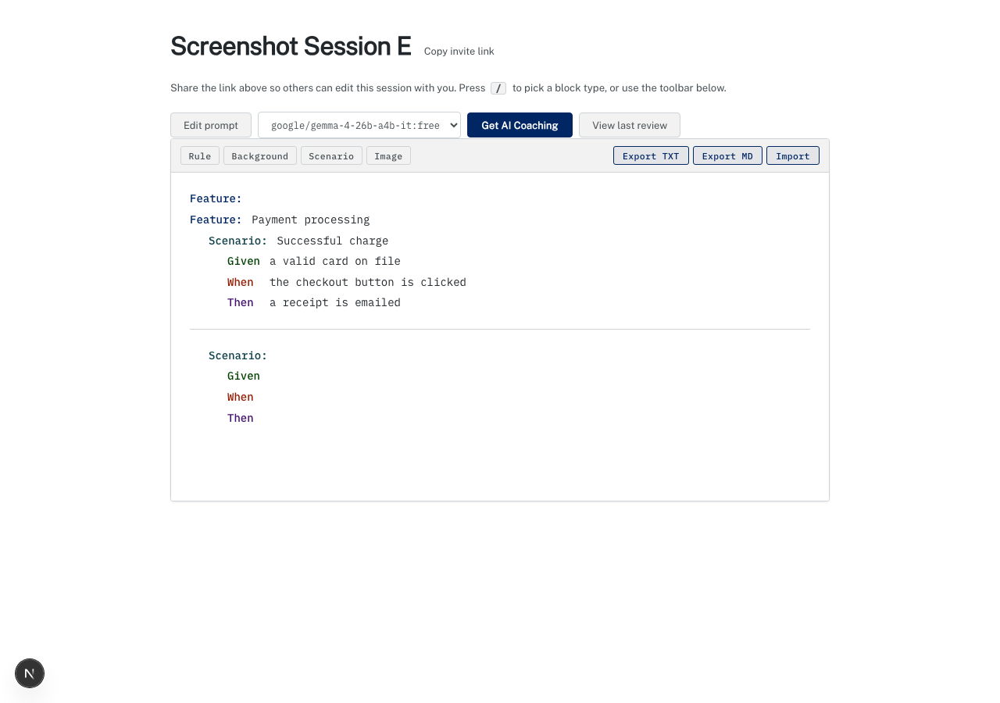

---

## AI Coaching

The **Get AI Coaching** button sends the current document to an LLM (selectable from the dropdown) and opens a modal with structured feedback rendered as Markdown. Useful for catching vague steps, missing edge cases, or structural issues before exporting to Jira.

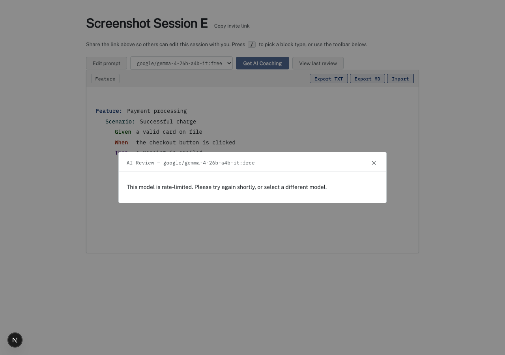

While a review is in flight, the button is disabled and shows **Reviewing…** so it's clear a request is pending. After closing the modal, a **View last review** button appears to re-open the cached result without re-running the request.

### Editing the prompt

The **Edit prompt** button opens a modal where you can customise the system prompt sent to the LLM. Changes are saved per-session and persist across page refreshes. The Save button is disabled until the prompt is at least 10 characters.

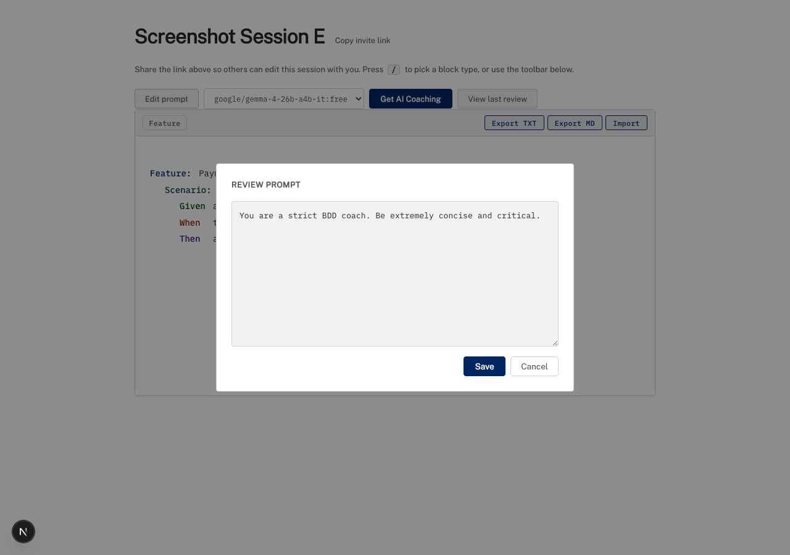

---

## Getting started

### Prerequisites

- Node.js 20+

### Setup

```bash
# 1. Install dependencies
npm install

# 2. Set up environment variables
cp .env.example .env.local
# Edit .env.local and fill in your DATABASE_URL and AUTH_SECRET

# 3. Set up the database
npx prisma migrate dev

# 4. Seed the dev database
npm run seed

# 5. Start both servers
npm run dev      # Next.js on http://localhost:3000
npm run dev:ws   # Y.js WebSocket on ws://localhost:1234
```

Both `dev` and `dev:ws` must be running for real-time collaboration to work.

### Commands

| Command | What it does |
|---|---|
| `npm run dev` | Start Next.js dev server |
| `npm run dev:ws` | Start Y.js WebSocket sync server |
| `npm run build` | Build for production |
| `npm run test` | Run Vitest unit tests |
| `npm run lint` | Lint the codebase |
| `npx prisma migrate dev` | Apply database migrations |
| `npx prisma studio` | Browse the database in a UI |

---

## Docs

- [docs/technical.md](./docs/technical.md) — architecture, design, and test coverage
- [SPEC.md](./SPEC.md) — what the app does and who uses it
- [DECISIONS.md](./DECISIONS.md) — why the stack was chosen
- [TESTING.md](./TESTING.md) — testing strategy
- [CLAUDE.md](./CLAUDE.md) — orientation for AI-assisted development

## Logs

Runtime logs are written to `logs/app.log` and `logs/error.log`. These are not committed to git.
