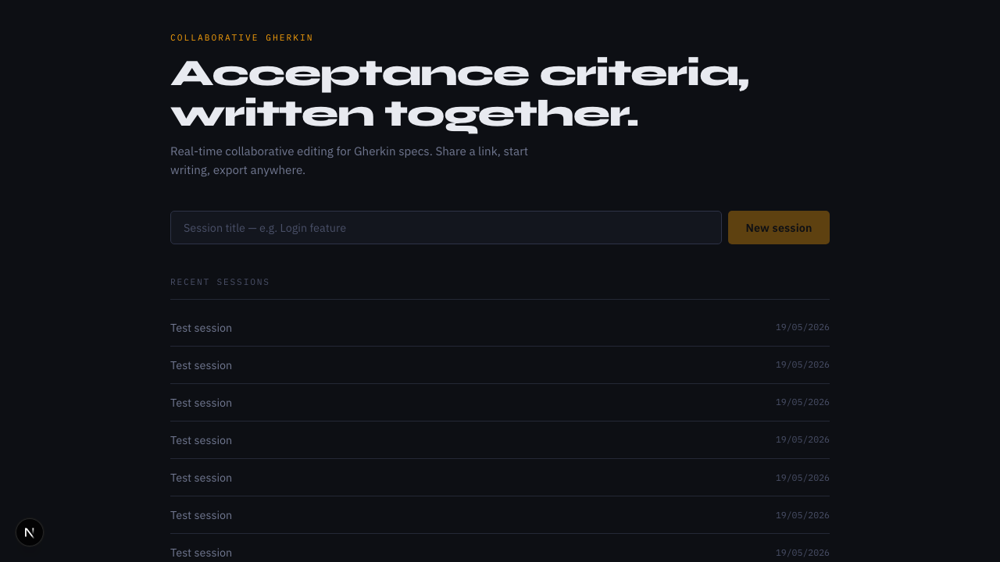
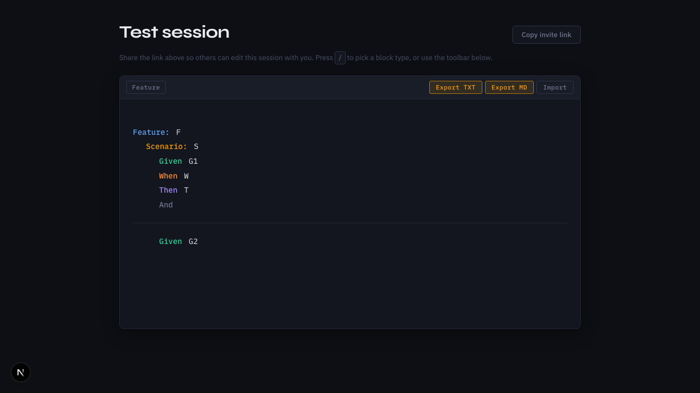

# Collaborative Gherkin — Project Overview

## Screenshots

**Home page** — create a named session or resume a recent one:



**Session page** — structured Gherkin editing with live collaboration:



---

## What it does

A real-time collaborative editor for writing Gherkin acceptance criteria. Multiple people share a URL and edit the same document simultaneously. Sessions are ephemeral workspaces — the end product is exported Gherkin text or Markdown for tools like Jira, not a permanent record.

---

## Architecture

### Two-server model

The Next.js app server handles HTTP (sessions API, page rendering) while a separate standalone Y.js WebSocket server (`y-websocket-server.mjs`) handles real-time sync. Both must run concurrently:

```bash
npm run dev      # Next.js on http://localhost:3000
npm run dev:ws   # Y.js WebSocket on ws://localhost:1234
```

### Editor (`src/components/GherkinEditor.tsx`)

A single client component built on:

- **Tiptap** — ProseMirror-based rich text editor
- **Y.js + y-websocket** — CRDTs powering real-time multi-user sync
- **CollaborationCursor** — shows other users' carets with coloured labels

Three custom ProseMirror node types:

| Node | Description |
|---|---|
| `GherkinParagraph` | Every text block; carries `data-gherkin-type` driving CSS keyword labels and indentation |
| `GherkinDataTable` | Inline editable table with a floating toolbar (add/delete rows and columns) |
| `GherkinImage` | Images embedded as base64 data URIs via drag-and-drop or file picker |

### Gherkin structure (`src/lib/gherkin.ts`)

All structural rules live here and nowhere else:

- `ALLOWED_AFTER` — adjacency grammar (e.g. `scenario` can only follow `feature`, `rule`, or `then`)
- `canFollow()` — enforced before inserting any block
- `NEXT_BLOCK_ON_ENTER` — what Enter produces after each block type
- `exportToText()` / `exportToMarkdown()` / `parseGherkin()` — import/export logic

### Database

SQLite in dev, PostgreSQL in production, via Prisma. Two models: `User` and `Session`. The session's `content` field stores `{}` by default — actual document state lives in Y.js (in-memory in the WebSocket server), not in the database.

### Auth

NextAuth.js v5 is wired into the schema but not yet hooked up to the UI. Session creation currently uses a hardcoded placeholder `userId`.

---

## User-facing features

| Feature | How it works |
|---|---|
| Create a session | Home form → `POST /api/sessions` → redirects to `/sessions/:id` |
| Real-time collaboration | Share the URL; Y.js syncs all edits via WebSocket |
| Block insertion | Toolbar buttons or `/` key → block picker dropdown (keyboard-navigable) |
| Smart Enter | Pressing Enter auto-inserts the contextually correct next block type |
| Block type switching | Press `/` on an existing typed block to replace its type |
| Data tables | Inserted from toolbar or `/`; supports add/delete rows and columns |
| Image embedding | Drag-and-drop or file picker; stored as base64 data URIs |
| Import | Paste raw Gherkin (or Markdown-prefixed Gherkin) into a modal; parsed and inserted at cursor |
| Export TXT | Downloads `gherkin.txt` — plain `Keyword: text` format |
| Export MD | Downloads `gherkin.md` — headings for Feature/Scenario, list items for steps |
| Copy invite link | One-click copy of the session URL |

---

## Visual design

Dark editorial theme: near-black `#0d0f14` background, Syne (display) + IBM Plex Sans (body) + IBM Plex Mono (editor/labels). Gherkin keywords are colour-coded inline via CSS `::before` pseudo-elements:

- **Blue** — `Feature`, `Rule`, `Background`
- **Amber** — `Scenario`
- **Green** — `Given`
- **Orange** — `When`
- **Violet** — `Then`
- **Muted** — `And`, `But`

Scenario boundaries are visually separated by a top border.

---

## Test coverage

- **Vitest unit tests** — `src/lib/gherkin.test.ts` (structural rules, export/import logic) and `src/app/api/sessions/sessions-api.test.ts`
- **Playwright e2e tests** — 8 spec files covering: block picker, collaboration, data tables, Enter-key progression, export, import, toolbar, and visual separation

---

## Known gaps

- Auth is schema-only — all sessions are created under a single seed user
- Y.js document state is not persisted to the database; restarting the WebSocket server loses in-progress content
- No session deletion UI (the `DELETE /api/sessions/:id` route exists but is not exposed in the UI)
